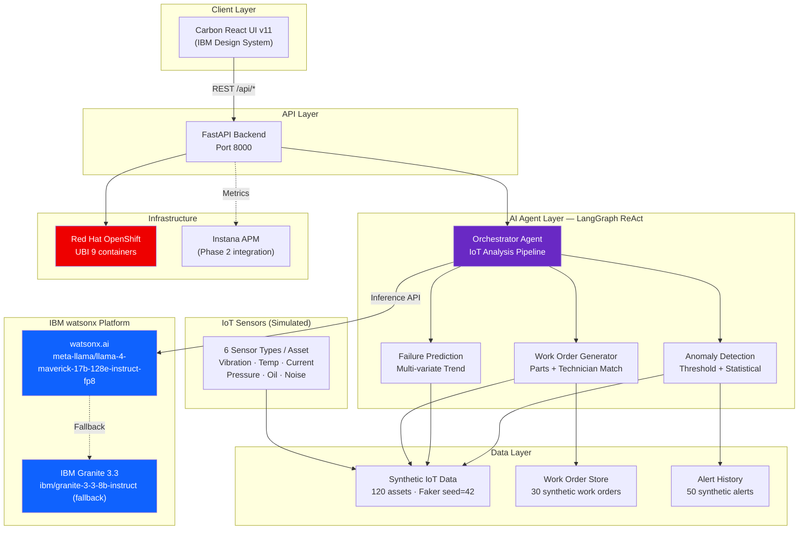

# Architecture — Factory AI Predictive Maintenance
## DEMO-MFG-001 · Built with IBM watsonx

---

## Solution Summary

An IBM watsonx AI agent continuously monitors IoT sensor telemetry from 120+ factory assets. The AI detects degradation patterns 7–14 days before failure, predicts the specific failure mode with >94% accuracy, and automatically generates prioritized maintenance work orders — matched to the right technician and pre-populated with recommended spare parts.

| Dimension | Value |
|---|---|
| **Client Code** | DEMO-MFG-001 |
| **Industry** | Manufacturing |
| **Primary IBM Product** | IBM watsonx.ai (Llama 4 Maverick / Granite 3.3) |
| **AI Pattern** | LangGraph ReAct Agent → IoT Anomaly Detection → Failure Prediction → Work Order Generation |
| **Demo Mode** | Mock (default, zero credentials) / Live (IBM Cloud watsonx.ai) |
| **Assets Monitored** | 120 synthetic equipment assets, 5 plants |
| **Prediction Lead Time** | 7–14 days before failure |

---

## Architecture Diagram



---

## Component Inventory

| Component | Version | Role | Layer |
|---|---|---|---|
| Carbon React | v11.73 | Full UI shell — 5 pages, g90 dark theme | Frontend |
| @carbon/charts-react | v1.20 | Area, Donut, Bar, Line charts | Frontend |
| React Router | v6.27 | SPA routing, lazy-loaded pages | Frontend |
| FastAPI | 0.115 | REST API backend, CORS, dual-mode | Backend |
| Pydantic Settings | 2.9 | Config management, env validation | Backend |
| Faker | 30.8 seed=42 | Synthetic IoT data, 120 equipment assets | Data |
| ibm-watsonx-ai | ≥1.1.0 | watsonx.ai SDK (live mode only) | IBM Platform |
| LangGraph | ≥0.2.0 | ReAct agent pipeline (live mode) | AI Agent |
| Llama 4 Maverick | meta-llama/llama-4-maverick-17b-128e-instruct-fp8 | Default LLM — multimodal | IBM Platform |
| Granite 3.3 8B | ibm/granite-3-3-8b-instruct | IBM-brand story alternative | IBM Platform |
| UBI 9 nginx-124 | ubi9/nginx-124 | OpenShift-safe frontend container | Infra |
| UBI 9 python-311 | ubi9/python-311 | OpenShift-safe backend container | Infra |

---

## Data Flow

```
IoT Sensors → Synthetic Data Service (Faker, seed=42)
             → FastAPI /api/data/equipment (120 assets, sensor readings)
             → FastAPI /api/ai/analyze (POST)
             → LangGraph ReAct Agent
               → Step 1: Threshold anomaly check (per sensor type)
               → Step 2: Multi-variate trend analysis (30-day window)
               → Step 3: Failure mode classification (vibration/pressure/oil/etc.)
               → Step 4: watsonx.ai LLM inference (analysis + work order generation)
             → Response: { analysis, work_order, confidence, tokens, latency_ms }
             → Frontend: AIResponsePanel renders work order card
```

---

## Integration Points

| System | Method | Status |
|---|---|---|
| IBM watsonx.ai | ibm-watsonx-ai SDK, `/ml/v1/text/chat` | Mock (default) / Live (credentials) |
| IBM Instana APM | OpenTelemetry → Instana endpoint | Phase 2 (architecture shown) |
| CMMS / ServiceNow | REST API, work order push | Phase 2 (future integration) |
| OPC-UA / MQTT IoT | Real-time sensor stream | Phase 2 (synthetic in demo) |

---

## Security Architecture

- All credentials via environment variables (never hardcoded)
- `.env` gitignored
- No PII — synthetic data only
- CORS restricted to localhost dev origins
- OpenShift deployment uses UBI 9 (FIPS-compliant, hardened)
- No `eval()` or `dangerouslySetInnerHTML`

---

## Deployment Architecture

```
DEPLOY_TARGET: openshift
BUILD_ARCH:    amd64

Container Registry
├── factory-ai-frontend  (ubi9/nginx-124, port 8080)
└── factory-ai-backend   (ubi9/python-311, port 8000)

Build: docker build --platform linux/amd64 -t <image> -f Dockerfile.<name> .
```

---

## Non-Functional Requirements

| NFR | Target | Status |
|---|---|---|
| Mock mode startup | < 3 seconds | ✅ In-memory data |
| AI response latency (mock) | 800–1500ms simulated | ✅ Realistic UX |
| Frontend build | < 60 seconds | ✅ Vite |
| Zero credentials required | Mock mode | ✅ Fully offline |
| WCAG 2.1 AA | Keyboard nav, ARIA labels | ✅ Carbon v11 |
| OpenShift SCC | Random UID, no root | ✅ UBI 9 base images |

---

## IBM Product Versions

| Product | Version / ID |
|---|---|
| IBM watsonx.ai | SaaS (us-south) |
| Default LLM | meta-llama/llama-4-maverick-17b-128e-instruct-fp8 |
| Granite fallback | ibm/granite-3-3-8b-instruct |
| Carbon Design System | v11.73 |
| Red Hat OpenShift | 4.14+ (ROKS/on-prem) |
| UBI 9 | nginx-124, python-311, nodejs-20 |
